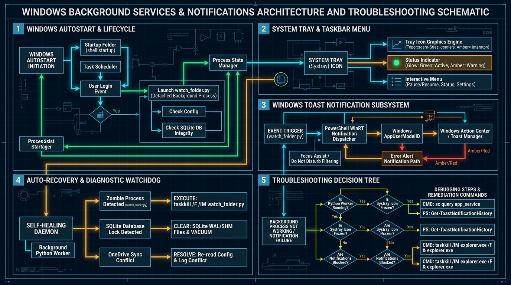

# 08. Windows Background Services, Taskbar Integration & Troubleshooting Guide

## 1. Executive Summary & Problem Context
In long-running Windows desktop environments, background automation services (such as folder monitors, system tray icons, autostart daemons, and desktop toast notifications) face unique operating system challenges. Common points of failure include:
- **Silent Process Termination**: Background Python scripts (`pythonw.exe`) crashing silently without terminal output.
- **OneDrive Sync Lock Collisions**: OneDrive holding exclusive read/write handles on `task_list.json` or `vector_store.sqlite`.
- **System Tray Icon Orphanage**: Windows Explorer restarting (`explorer.exe`) or taskbar shell crashes destroying tray icon message hooks.
- **Notification Drop / Suppression**: Windows 10/11 **Focus Assist**, "Do Not Disturb", or missing `AppUserModelID` registrations silently dropping toast alerts.
- **Autostart Timing Failures**: Scripts launching on Windows login before network drives, Python PATH, or OneDrive folders are mounted.

This guide details the complete architecture of these subsystems, provides operational runbooks, and supplies an exhaustive troubleshooting decision tree with exact remediation commands.

---

## 2. Technical Architecture & Troubleshooting Schematic



---

## 3. Subsystem Breakdown & How They Work

### A. Windows Background Process & Watcher Daemon (`scripts/watch_folder.py`)
- **Intent**: Continuously inspects the library folder for newly added `.pdf`, `.epub`, `.txt`, or `.md` files without requiring manual user execution.
- **Process Mechanics**:
  1. Runs in a non-blocking 5-second polling loop.
  2. Traverses the directory using `os.scandir()` / `glob.glob()`.
  3. Loads `output_taxonomy/task_list.json` using atomic read-locks.
  4. Appends new files as `"status": "pending"` and saves the JSON registry.
- **Headless Detachment (`pythonw.exe`)**:
  When launched in the background (detached), standard output and error streams (`stdout`/`stderr`) are disconnected from any console window. Uncaught Python exceptions will terminate the process immediately without user notification unless explicitly logged.

---

### B. Windows Autostart Subsystem
Autostart can be configured via three distinct Windows mechanisms:

| Mechanism | Location / Trigger | Advantages | Common Failure Modes |
| :--- | :--- | :--- | :--- |
| **Startup Folder** *(Recommended)* | `shell:startup` (`%APPDATA%\Microsoft\Windows\Start Menu\Programs\Startup`) | Runs under user privileges; easy to view and enable/disable in Task Manager. | Can fail if Python virtual environment or working directory (`cd /d`) is not explicitly set in the shortcut. |
| **Windows Task Scheduler** | `schtasks.exe` (Trigger: "At Log on of any user") | Highly resilient; supports automatic restart on failure and delayed launch (e.g. +30s). | UAC permission boundaries; environment variables might differ from interactive shell. |
| **Registry Run Key** | `HKCU\Software\Microsoft\Windows\CurrentVersion\Run` | Lightweight registry entry. | Security software / Antivirus may flag or block modifications. |

---

### C. System Tray & Taskbar Menu Subsystem
- **Message Loop Requirement**: A Windows system tray icon must maintain an active Windows API message pump (`GetMessage` / `DispatchMessage` loop via `pystray` or Win32 COM).
- **Explorer.exe Crash Recovery**: When Windows Explorer crashes or restarts, it re-registers the taskbar window (`TaskbarCreated` broadcast message). If a tray daemon does not listen for `TaskbarCreated`, its icon disappears even though the Python process is still running.
- **Frozen UI Threads**: If the background worker performs heavy disk I/O or vector calculations on the main GUI thread, the taskbar right-click menu freezes and Windows marks it "Not Responding".

---

### D. Windows Toast Notification Subsystem
- **Notification Pipeline**:
  `Python Event Trigger` $\rightarrow$ `PowerShell WinRT Dispatcher` $\rightarrow$ `Windows.UI.Notifications.ToastNotificationManager` $\rightarrow$ `Windows Action Center`.
- **AppUserModelID (AUMID)**: Windows requires every notification source to register an Application ID (e.g. `Microsoft.WindowsTerminal_8wekyb3d8bbwe` or custom PowerShell AUMID).
- **Focus Assist / Do Not Disturb**: If Windows is set to "Alarms only" or "Priority only" (or during full-screen apps/gaming), toasts are silently routed directly to the Action Center tray without popping up on screen.

---

## 4. Root Causes of Failure & Diagnostic Runbook

```
                             [DIAGNOSTIC DECISION TREE]
                                          │
                        Is the background process running?
                                   /             \
                             [YES]                [NO]
                               │                    │
              Check Taskbar & Tray Icon      Check Startup & Logs
                     /            \                 │
             [Visible]          [Frozen/Missing]   1. Launch manually via CMD
                 │                     │           2. Verify Python on PATH
         Test Notifications      1. Kill zombie    3. Check directory permissions
                 │                  pythonw.exe
         Check Focus Assist      2. Restart daemon
         & AUMID Settings
```

---

## 5. Exhaustive Troubleshooting & Fix Procedures

### Issue 1: Background Watcher Not Running or Stopped Silently
**Symptoms**: You add a new book to the folder, but `task_list.json` does not update.
**Root Cause**: An uncaught exception (e.g. file lock collision or unhandled encoding) terminated the headless Python process.
**Remediation Steps**:
1. Check if the process is active:
   ```cmd
   tasklist | findstr /i "python"
   ```
2. Terminate any stuck or frozen zombie processes:
   ```cmd
   taskkill /F /IM python.exe /T
   taskkill /F /IM pythonw.exe /T
   ```
3. Test-run the watcher in an interactive console window to see live errors:
   ```cmd
   cd /d "d:\Firedancerx\OneDrive\My Library - 2021"
   python scripts\watch_folder.py "."
   ```

---

### Issue 2: Autostart Fails on Windows Reboot
**Symptoms**: After restarting your PC, the background service is not running.
**Root Cause**: The startup shortcut was launched without the proper Working Directory, or Windows executed it before the OneDrive path was mounted.
**Remediation Steps**:
1. Open the Windows Startup folder:
   Press `Win + R`, type `shell:startup`, and press Enter.
2. Verify the shortcut target and working directory:
   - **Target**: `cmd.exe /c "cd /d d:\Firedancerx\OneDrive\My Library - 2021 && python scripts\watch_folder.py ."`
   - **Start in**: `d:\Firedancerx\OneDrive\My Library - 2021`
3. Optional: Create an automated Task Scheduler job with a 30-second boot delay:
   ```cmd
   schtasks /Create /TN "KnowledgeLibraryWatcher" /TR "cmd /c cd /d \"d:\Firedancerx\OneDrive\My Library - 2021\" && python scripts\watch_folder.py ." /SC ONLOGON /DELAY 0000:30 /RL LIMITED /F
   ```

---

### Issue 3: Taskbar Icon Frozen, Disappeared, or Unresponsive
**Symptoms**: Right-clicking the taskbar icon does nothing, or the icon vanished after PC wake-up.
**Root Cause**: Windows Explorer restarted and unhooked the tray handle, or the background thread blocked the Windows message queue.
**Remediation Steps**:
1. Restart Windows Explorer to refresh the taskbar shell:
   ```cmd
   taskkill /F /IM explorer.exe & start explorer.exe
   ```
2. Re-launch the launcher menu:
   ```cmd
   cd /d "d:\Firedancerx\OneDrive\My Library - 2021"
   Run_Taxonomy_Pipeline.cmd
   ```

---

### Issue 4: Toast Notifications Never Appear on Screen
**Symptoms**: Books are processed, but no Windows desktop banner or chime occurs.
**Root Cause**: Windows **Focus Assist** / **Do Not Disturb** is blocking banner popups, or PowerShell script execution is restricted.
**Remediation Steps**:
1. Check Windows Notification Settings:
   - Go to **Windows Settings -> System -> Notifications**.
   - Ensure **Notifications** are toggled **ON**.
   - Under **Focus Assist**, select **Off** (or verify Priority list rules).
2. Test a direct Windows Toast Notification via PowerShell:
   ```powershell
   powershell -Command "[Windows.UI.Notifications.ToastNotificationManager, Windows.UI.Notifications, ContentType = WindowsRuntime] | Out-Null; $template = [Windows.UI.Notifications.ToastNotificationManager]::GetTemplateContent([Windows.UI.Notifications.ToastTemplateType]::ToastText02); $textNodes = $template.GetElementsByTagName('text'); $textNodes.Item(0).AppendChild($template.CreateTextNode('KM Library System')) | Out-Null; $textNodes.Item(1).AppendChild($template.CreateTextNode('Toast notification subsystem is 100% OPERATIONAL!')) | Out-Null; $toast = [Windows.UI.Notifications.ToastNotification]::new($template); [Windows.UI.Notifications.ToastNotificationManager]::CreateToastNotifier('Windows PowerShell').Show($toast);"
   ```

---

### Issue 5: SQLite Database Locked Error (`database is locked`)
**Symptoms**: The background process crashes with `sqlite3.OperationalError: database is locked`.
**Root Cause**: A previous crashed process left stale SQLite write-ahead logs (`.sqlite-wal` / `.sqlite-shm`) or OneDrive cloud sync locked the file.
**Remediation Steps**:
1. Kill all Python processes holding file handles:
   ```cmd
   taskkill /F /IM python.exe
   ```
2. Clear stale SQLite temporary journaling files:
   ```cmd
   cd /d "d:\Firedancerx\OneDrive\My Library - 2021\output_taxonomy\vector_store"
   del /f /q vector_store.sqlite-wal vector_store.sqlite-shm
   ```
3. Verify SQLite database integrity:
   ```bash
   python -c "import sqlite3; conn = sqlite3.connect('output_taxonomy/vector_store/vector_store.sqlite'); print('Integrity Check:', conn.execute('PRAGMA integrity_check;').fetchall()); conn.close()"
   ```

---

## 6. Self-Healing Watchdog Best Practices

To ensure 99.9% uptime for the background monitoring daemon without manual intervention:
1. **Always Use Explicit Working Directories**: Never rely on relative paths in Windows scheduled tasks or shortcuts. Always enforce `cd /d "d:\Firedancerx\OneDrive\My Library - 2021"`.
2. **Wrap Database Operations in Context Managers**: All SQLite connections in [`scripts/vector_store.py`](../scripts/vector_store.py) utilize `with sqlite3.connect(...) as conn:` to guarantee instant lock release upon query completion.
3. **Use the Interactive Menu as Primary Control**: When in doubt, launch [`Run_Taxonomy_Pipeline.cmd`](../Run_Taxonomy_Pipeline.cmd) to view real-time logs and verify service states.
