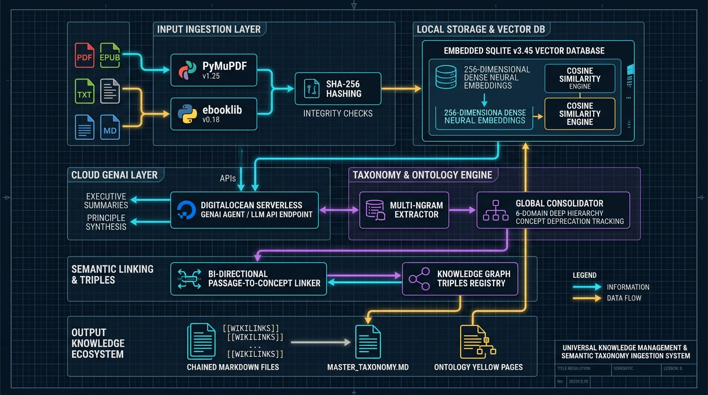

# 📚 Universal Knowledge Management & Semantic Taxonomy Ingestion System
## Comprehensive Technical Documentation Suite

Welcome to the central technical documentation portal for the **Universal Knowledge Management (KM) & Semantic Taxonomy Ingestion System**. This software platform transforms static document collections (PDF, EPUB, TXT, MD) into an interconnected, semantically indexed, and densely linked digital knowledge graph.



---

## 📑 Documentation Guide

| Chapter | Document | Core Focus & Description |
| :--- | :--- | :--- |
| **01** | [**01. System Architecture & Overview**](./01_System_Architecture_and_Overview.md) | High-level architectural blueprint, visual schematic diagram, component catalog with explicit version numbers, and system topology. |
| **02** | [**02. Knowledge Management Framework**](./02_Knowledge_Management_Framework.md) | Alignment with universal KM paradigms: PPT Triad, SECI Model (Nonaka & Takeuchi), Hansen's Codification/Personalization, and Ontological Engineering. |
| **03** | [**03. Pipeline Execution Flow**](./03_Pipeline_Execution_Flow.md) | Step-by-step breakdown of the 5-phase data pipeline from raw file scanning to rendered Markdown wikilinks. |
| **04** | [**04. Vector Store & Cloud GenAI Integration**](./04_Vector_Store_and_Cloud_LLM.md) | Mathematical 256-dimensional dense embedding model, embedded SQLite vector store, cosine similarity thresholds, and DigitalOcean GenAI Agent API integration. |
| **05** | [**05. Universal Chunking & Chaining**](./05_Universal_Chunking_and_Chaining.md) | Universal pagination protocol for large Markdown and JSON files, header/footer breadcrumb navigation, and chunk-linking algorithms. |
| **06** | [**06. Component & API Reference**](./06_Component_and_API_Reference.md) | Detailed reference of all 11 Python modules, classes, methods, data schemas, inputs, outputs, and error handlers. |
| **07** | [**07. User Operations & Launchers**](./07_User_Operations_and_Launchers.md) | Operational manual for Windows command menus, desktop shortcuts, live background folder monitoring service, and Obsidian/Markdown viewing. |
| **08** | [**08. Windows Background Services & Troubleshooting**](./08_Windows_Background_Services_and_Troubleshooting.md) | Specialized guide & schematic for troubleshooting Windows background daemons, autostart, frozen taskbar icons, Focus Assist toast notifications, and SQLite database locks. |

---

## 🚀 Quick Start & Common Tasks

### 1. Run the Full End-to-End Pipeline
Execute the full 5-step pipeline via the interactive command launcher:
```cmd
Run_Taxonomy_Pipeline.cmd
```
Select `[1]` to run full ingestion, vector embedding, taxonomy consolidation, semantic linking, and Markdown rendering.

### 2. Desktop One-Click Shortcuts
Generate instant desktop launcher shortcuts:
```powershell
powershell -ExecutionPolicy Bypass -File scripts\create_shortcut.ps1
```

### 3. Run Taxonomy Hygiene Audit
Audit knowledge connectivity and detect orphan concepts:
```bash
python scripts\taxonomy_hygiene.py --output-dir ./output_taxonomy
```

### 4. Background Service & Notification Diagnostics
Inspect running background processes and test Windows Toast alerts:
```cmd
tasklist | findstr /i "python"
```
